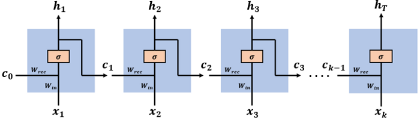
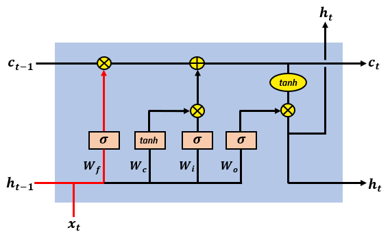

本文试图探究的问题：

1. 什么是RNN？
2. 为什么RNN会出现梯度爆炸/梯度消失问题？
3. 什么是LSTM？
4. LSTM是如何保证梯度可以正常传递的？

本文是笔者学习过程中对博客的笔记，原作者在评论里说欢迎翻译为日文，我就试着翻译为中文吧hhh。但是感觉博客以及我提出了自己的看法。参考的几个博客在文末给出链接

#### RNN

##### 什么是RNN

对于给定的输入序列$<x_1, x_2, ...., x_k>$ , 网络将其编码成$<h_1, ...., h_k>$，其中$h_t$代表$x_t$以及其之前信息的编码。整个网络有两个参数矩阵$W_{rec}， W_{in}$, $h_t$的计算公式如下：
$$
h_{t}=\sigma\left(W_{r e c} \cdot h_{t-1}+W_{i n} \cdot x_{t}\right)
$$
整个网络如上图所示，$c_t$就是$h_t$, $c_0=h_0$是隐层的初始化状态，一般是零向量。

##### 为什么RNN会出现梯度消失/爆炸问题

记$W = [W_{rec}, W_{in}]$；$L_t$是编码$h_t$对应的损失，是关于$W$的函数；$L$为总损失；则：
$$
\frac{\partial L}{\partial W}=\sum_{t=1}^{T} \frac{\partial L_{t}}{\partial W}
$$
计算完之后我们可以通过$W \leftarrow W-\alpha \frac{\partial E}{\partial W}$来更新参数。

其中$\frac{\partial L_{t}}{\partial W}$又可以写成如下形式：
$$
\frac{\partial L_{k}}{\partial W}=\frac{\partial L_{k}}{\partial h_{k}} \frac{\partial h_{k}}{\partial h_{k-1}} \cdots \frac{\partial h_{2}}{\partial h_{1}} \frac{\partial h_{1}}{\partial W} = \frac{\partial L_{k}}{\partial h_{k}} \left(\prod_{t=2}^{k} \frac{\partial h_{t}}{\partial h_{t-1}}\right) \frac{\partial h_{1}}{\partial W}
$$
将$h_t$的计算公式带入，得到$\frac{\partial h_{t}}{\partial h_{t-1}}=\sigma^{\prime}\left(W_{r e c} \cdot h_{t-1}+W_{i n} \cdot x_{t}\right) \cdot W_{r e c}$，那么$\frac{\partial L_{t}}{\partial W}$又可以写成：
$$
\frac{\partial L_{k}}{\partial W}=\frac{\partial L_{k}}{\partial h_{k}} \left(\prod_{t=2}^{k} \sigma^{\prime}\left(W_{r e c} \cdot h_{t-1}+W_{i n} \cdot x_{t}\right) \cdot W_{r e c}\right) \frac{\partial h_{1}}{\partial W}
$$
但是一般激活函数$\sigma(x) = \tanh (x)=\frac{e^{x}-e^{-x}}{e^{x}+e^{-x}}$, 其导数$\sigma^{\prime}(x) = 1 - (\sigma(x))^2$，是一个在区间$[0, 1)$之间的数，这个连乘就会导致梯度消失；如果激活函数是sigmoid问题会更大，sigmoid导数绝对值的上界是0.25，一下子就没了；而$W_{rec}$要是特征值比较大，连乘还会导致梯度爆炸

 

#### LSTM

##### 什么是LSTM 

$$
\begin{aligned}
\text{forget gate} \quad f_{t} &=\sigma\left(W_{f} \cdot\left[h_{t-1}, x_{t}\right]+b_{f}\right) \\
\text{input gate} \quad i_{t} &=\sigma\left(W_{i} \cdot\left[h_{t-1}, x_{t}\right]+b_{i}\right) \\
\text{tmp cell state} \quad \tilde{c}_{t} &=\tanh \left(W_{C} \cdot\left[h_{t-1}, x_{t}\right]+b_{C}\right) \\
\text{cell state} \quad c_{t} &=f_{t} * c_{t-1}+i_{t} * \tilde{c}_{t} \\
\text{output gate} \quad o_{t} &=\sigma\left(W_{o}\left[h_{t-1}, x_{t}\right]+b_{o}\right) \\
\text{hidden state} \quad h_{t} &=o_{t} * \tanh \left(c_{t}\right)
\end{aligned}
$$
这里引入了三个门(forget gate、input gate、output gate)，每个门其实就是[0, 1]之间的一个数，可以调整比例；另外引入$W_C$来做对新信息的提取

- forget gate调整之前信息所占的比例
- input gate调整新信息所占的比例
- output gate做了一个过滤，将当前状态中的信息有选择的进行输出。

而$c_t$所编码是$<x_1, ..., x_t>$这个序列所包含的特征，例如序列之间的依赖关系等(这里我自己按照半个上下文特征理解了，也就是只有上文特征；目前也就是个黑匣子，仁者见仁智者见智吧)

值得注意的是，LSTM其实有很多变种，下面介绍几个常见变种

-  [Gers & Schmidhuber (2000)](https://ieeexplore.ieee.org/document/861302) 在计算gate的时候还考虑了old cell state，具体可以看下图：

- GRU，最为常见的变种，将forget gate和input gate合并为一个update gate $z_t$，并且在计算tmp cell state的时候对来自过去的信息增加reset gate $r_t$做一个过滤
  

##### LSTM是如何保证梯度可以正常传递的？

和上面分析类似，我们可以得到：
$$
\frac{\partial E_{k}}{\partial W} =\frac{\partial E_{k}}{\partial h_{k}} \frac{\partial h_{k}}{\partial c_{k}} \cdots \frac{\partial c_{2}}{\partial c_{1}} \frac{\partial c_{1}}{\partial W} =\frac{\partial E_{k}}{\partial h_{k}} \frac{\partial h_{k}}{\partial c_{k}}\left(\prod_{t=2}^{k} \frac{\partial c_{t}}{\partial c_{t-1}}\right) \frac{\partial c_{1}}{\partial W}
$$
在LSTM中，我们展开可以得到：
$$
c_{t}=c_{t-1} *  \sigma\left(W_{f} \cdot\left[h_{t-1}, x_{t}\right]\right) + \tanh \left(W_{c} \cdot\left[h_{t-1}, x_{t}\right]\right) * \sigma\left(W_{i} \cdot\left[h_{t-1}, x_{t}\right]\right)
$$
求导得到：
$$
\begin{aligned}
\frac{\partial c_{t}}{\partial c_{t-1}} =&\frac{\partial f_{t}}{\partial c_{t-1}} \cdot c_{t-1}+\frac{\partial c_{t-1}}{\partial c_{t-1}} \cdot f_{t}+\frac{\partial i_{t}}{\partial c_{t-1}} \cdot \tilde{c}_{t}+\frac{\partial \tilde{c}_{t}}{\partial c_{t-1}} \cdot i_{t} \\
=&\sigma^{\prime}\left(W_{f} \cdot\left[h_{t-1}, x_{t}\right]\right) \cdot W_{f} \cdot o_{t-1} \otimes \tanh ^{\prime}\left(c_{t-1}\right) \cdot c_{t-1} \\
&+f_{t} \\
&+\sigma^{\prime}\left(W_{i} \cdot\left[h_{t-1}, x_{t}\right]\right) \cdot W_{i} \cdot o_{t-1} \otimes \tanh ^{\prime}\left(c_{t-1}\right) \cdot \tilde{c}_{t} \\
&+\sigma^{\prime}\left(W_{c} \cdot\left[h_{t-1}, x_{t}\right]\right) \cdot W_{c} \cdot o_{t-1} \otimes \tanh ^{\prime}\left(c_{t-1}\right) \cdot i_{t}
\end{aligned}
$$
这里一方面有一个forget gate在导数里，另外剩下的几项是相加关系，那么$\frac{\partial E_{k}}{\partial W}$就不太会趋向于0了。另外的博客里我找到这么一个直观，由于$f_t$控制着之前的信息有多少会被记住，因此这个数字应该是趋向于1的。事实上，LSTM并不能算是完全解决了这个问题，但是它很好地缓解了这个问题。

我这里对第一个参考blog的解释提出质疑，他认为只要$\sum_{t=1}^{T} \frac{\partial E_{t}}{\partial W} \rightarrow 0$ 不成立就可了，但是这个感觉不太对，哪怕是RNN，t比较小时候对W的梯度也不会增加；但是RNN的问题在于，对于比较大的t, $\frac{\partial E_{k}}{\partial W}$必然会趋向于0，也就说RNN无法利用一个很长的序列后半部分的信息，这个是它梯度消失带来的问题；

另外LSTM除了可以限制梯度必须小于某个阈值，如果大于这个阈值，就取这个阈值进行更新。可以限制梯度必须小于某个阈值，如果大于这个阈值，就取这个阈值进行更新！(这一小段话引用自知乎用户[Bill](https://www.zhihu.com/people/xiao-nu-43)的回答)

##### 关于梯度爆炸的补充

解决梯度爆炸还有一个小技巧，可以限制梯度必须小于某个阈值，如果大于这个阈值，就取这个阈值进行更新！

参考链接：

[Nir Arbel: How LSTM networks solve the problem of vanishing gradients](https://medium.com/datadriveninvestor/how-do-lstm-networks-solve-the-problem-of-vanishing-gradients-a6784971a577)

